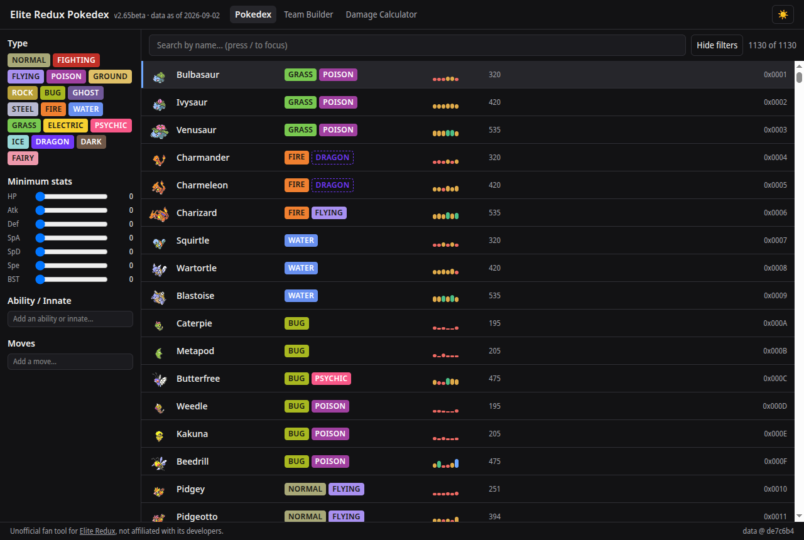
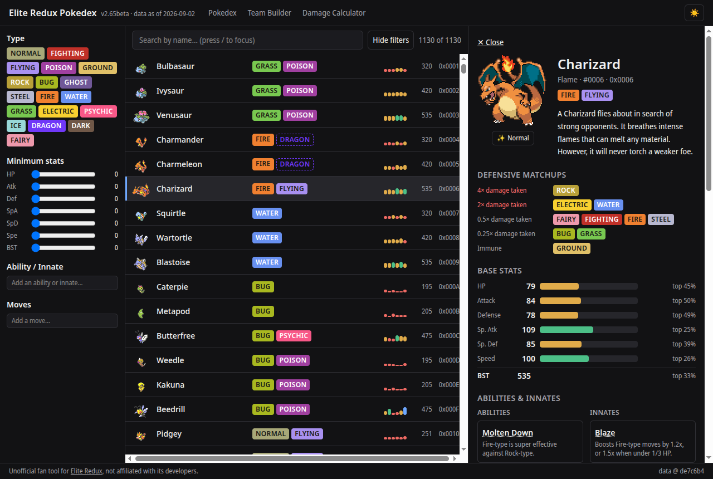
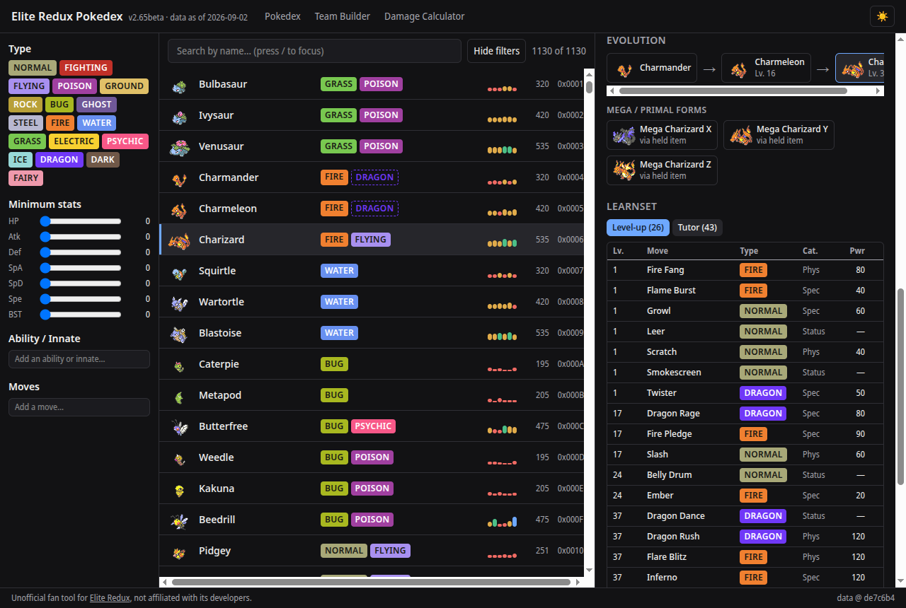
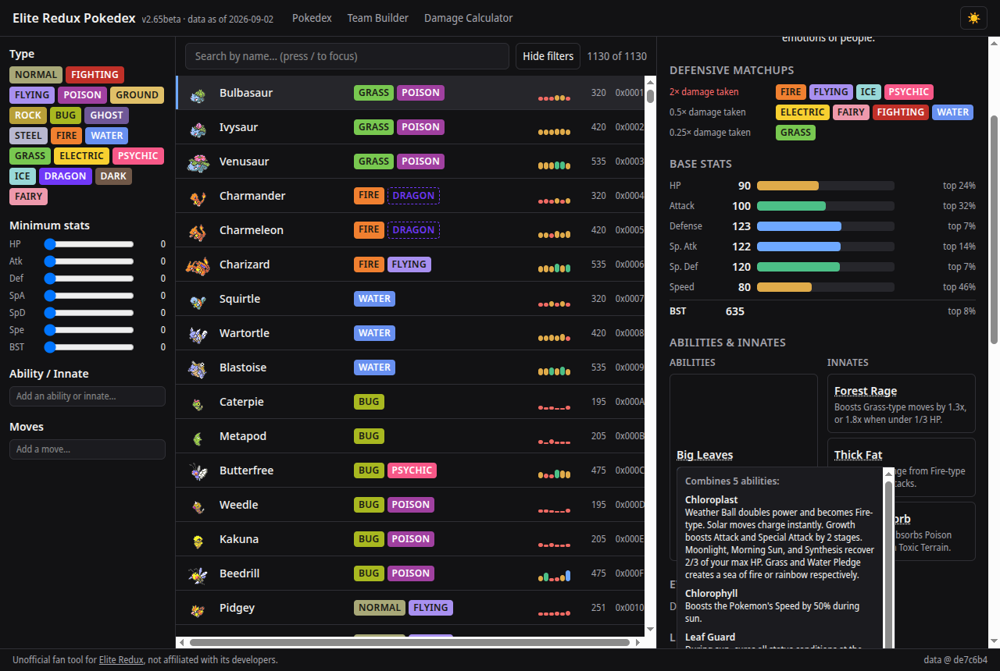
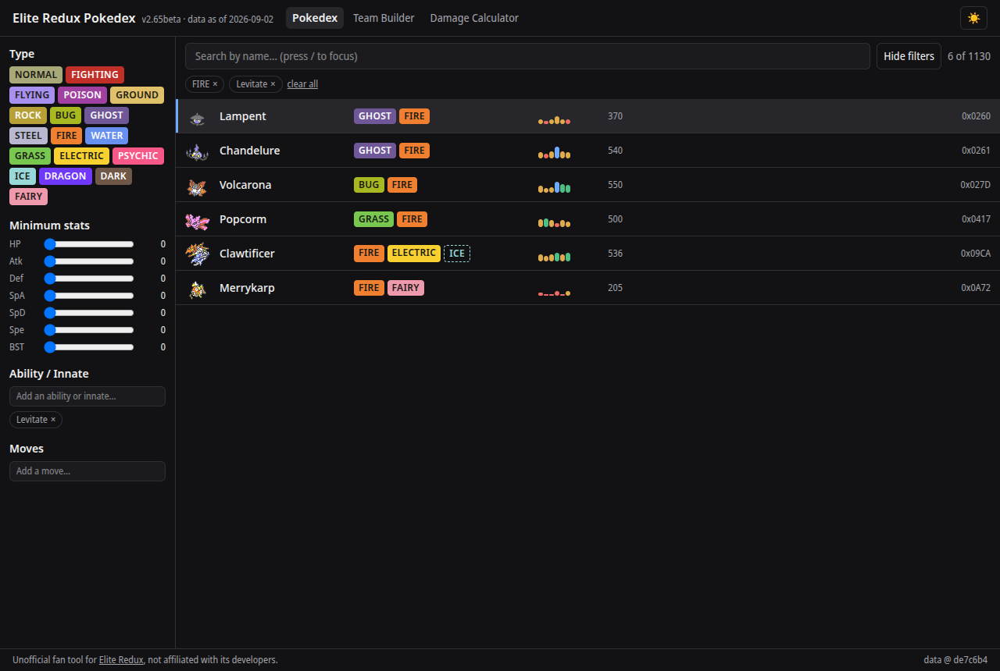
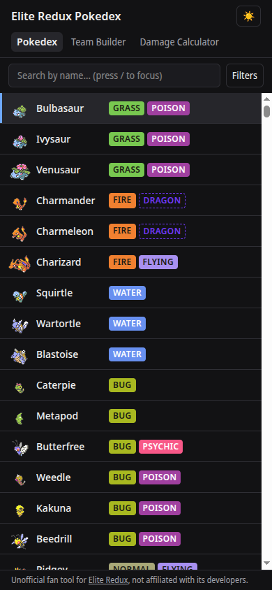
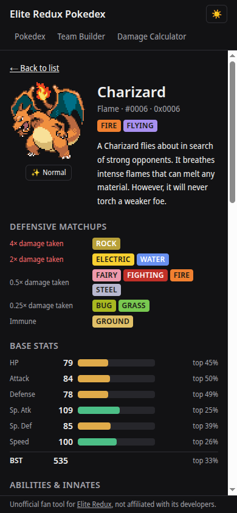

# Elite Redux Tools

Community tools for [Pokemon Elite Redux](https://eliteredux.net), a Pokemon Emerald
decomp ROM hack with 1,200+ species, a multi-ability system, and rebalanced stats,
types, and movesets that diverge from vanilla Pokemon.

## Pokedex

Live at **https://elite-redux-tools.pages.dev**.

Sourced directly from Elite Redux's own protobuf data (`Elite-Redux/er-config`), not
guessed at or reverse-engineered from generated C headers — see
[`CLAUDE.md`](./CLAUDE.md) for how the pipeline works and why that source was chosen.

- Search and filter by type, ability/innate, move, and base stat ranges — every
  filter combination is a shareable URL.
- Desktop shows list and detail side by side without losing your place; phones and
  tablets get a full-screen detail view.
- Defensive type matchups, evolution chains (mega/primal forms included), full
  level-up and tutor learnsets, and base stats colored by range.
- Species that carry a third type via an ability (e.g. Charmander's Half Drake adds
  Dragon) show it as a distinct, clearly-marked chip — not asserted as certain, since
  only one ability is ever active at a time.
- Hover or tap an ability for its extended explanation; compound abilities (fusions
  of several named abilities into one) break down into each component's own
  explanation.

See [Screenshots](#screenshots) below.

## Planned tools

Stubbed in the nav today, not yet built:

- **Team builder**
- **Damage calculator** — compute damage ranges accounting for Elite Redux's custom
  mechanics, movesets, and stat changes.

Also planned, not yet started:

- **Save editor** — inspect and edit Elite Redux save files.
- **Build recommender** — suggest movesets/EV spreads/held items for a given Pokemon
  and role.

## Development

```
# Data pipeline (Python, uv)
cd pipeline
uv sync --extra dev
uv run python -m erdata.build   # fetch -> parse -> resolve -> emit -> sprites
uv run pytest

# Frontend (TypeScript, Vite)
cd web
npm install
npm run dev      # copies the committed data/ snapshot into public/ first
npm run build
```

See [`docs/DEPLOY.md`](./docs/DEPLOY.md) for deploying to Cloudflare Pages.

## Data provenance

Game data is pinned to specific upstream commits, recorded in
[`sources.lock.json`](./sources.lock.json), and the generated snapshot under
`data/` is committed to this repo rather than fetched live — every build is
reproducible from the repo alone. The pinned source and commit are also shown in the
Pokedex's own footer.

Neither `Elite-Redux/er-config` nor `Elite-Redux/eliteredux-source` declares a
license. This repository's own code is MIT-licensed (below); the Elite Redux data
itself is used with attribution and is not relicensed as this project's own.
[ER-nextdex](https://github.com/ForwardFeed/ER-nextdex) is used only as an
independent test oracle to cross-check the pipeline's output (see
`pipeline/src/erdata/oracle.py`) — no code from it is reused.

## Screenshots

**Dashboard** — search, filter by type/stat/ability/innate/move, dense scannable rows.



**Split-pane detail (desktop)** — clicking a species opens its detail beside the list,
not over it; the list keeps its scroll position and filters.



**Mega/Primal forms** — reachable from the evolution section of the base species'
detail page.



**Ability popovers** — hover or tap an ability for its extended explanation; a
compound ability like Big Leaves breaks down into each component's own explanation,
and — since all 3 of Mega Venusaur's ability slots are genuinely the same ability in
the game data — collapses to one card instead of showing it three times.



**Filters** — every combination is a URL; a third, ability-granted type (dashed
border) shows up in results without being asserted as a guaranteed type.



**Mobile** — full-screen list and detail views, filters in a bottom sheet.




## Status

Pokedex live and actively developed. Team Builder and Damage Calculator are stubbed
in the nav ("Under construction") but not built yet. Not affiliated with the Elite
Redux development team.

## License

MIT — see [LICENSE](./LICENSE). Applies to this repository's own code; see "Data
provenance" above for the game data itself.
